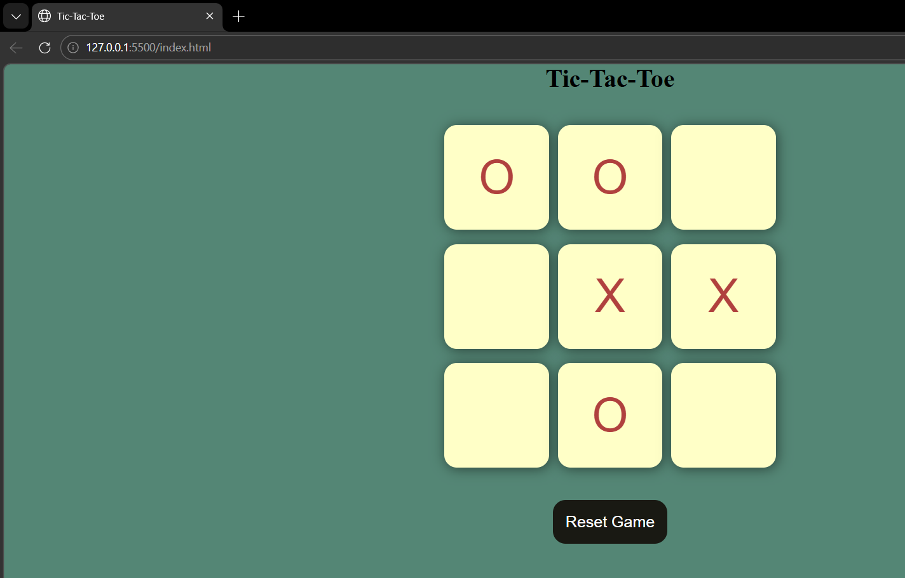

# Tic-Tac-Toe Simulator

An interactive Tic-Tac-Toe game built using HTML, CSS, and JavaScript. This project demonstrates core front-end development concepts such as DOM manipulation, event handling, and game logic implementation.

## Features

* Two-player mode (Player O vs Player X)
* Real-time turn switching
* Winner detection based on all possible patterns
* Draw detection when all boxes are filled
* Reset and New Game functionality
* Interactive and responsive UI
* Disabled boxes after selection (prevents overwriting moves)

## Tech Stack

* **HTML5** – Structure
* **CSS3** – Styling and layout
* **JavaScript (ES6)** – Game logic and interactivity

## How the Game Works

* The game is played between two players: **O** and **X**
* Players take turns clicking on empty boxes
* The first player uses **O**, the second uses **X**
* A player wins if they match any of the winning patterns:

  * Rows
  * Columns
  * Diagonals
* If all 9 boxes are filled and no winner is found, the game ends in a **Draw**
* Users can:

  * Click **Reset Game** to restart
  * Click **New Game** after a result is shown

## Winning Patterns Logic

The game checks these combinations to determine the winner:

[0,1,2], [0,3,6], [0,4,8],
[1,4,7], [2,5,8], [2,4,6],
[3,4,5], [6,7,8]

## Project Structure

tic-tac-toe-simulator/
│── index.html
│── style.css
│── app.js

## How to Run Locally

1. Clone the repository:

git clone https://github.com/Ramu6014/tic-tac-toe-simulator.git

2. Open the project folder

3. Run `index.html` in your browser

## Preview

## Author

**Ramu6014**
